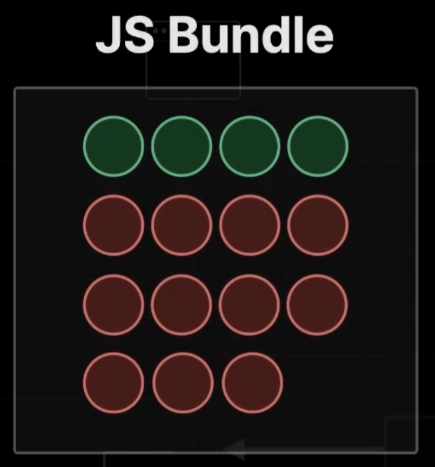

## 3.4 리액트 서버컴포넌트 이해하기

### 서버 컴포넌트 이전의 이야기

> Page Router 버전의 Next.js의 문제점

사전렌더링에서 화면의 상호작용을 하기 위해, 즉 수화(Hydration)을 하기 위해 우리가 작성한 모든 컴포넌트들을 Js Bundle로 후속으로 전달해준다. JS Bundle에 포함되어서 브라우저에게 전달된 리액트 컴포넌트들은 결국 브라우저측에서 Hydration을 위해서 한번더 실행된다.

하지만 JS Bundle안에 모든 컴포넌트들이 다 포함이 될 필요는 없다.  
(상호작용이 필요없는 정적인 컴포넌트들도 포함되어있기 떄문에)

하지만 pageRouter는 어떠한 컴포넌트든 페이지에 포함만된다면 전부다 JS Bundle에 묶어서 그대로 전부다 브라우저에 전달을 하기 때문에 JS Bundle의 용량이 쓸데없이 커지게 된다.  
그로인해 Bundle을 불러오는 시간도 오래걸리고 Hydratioin을 진행하는 시간도 오래 걸리기 때문에 결국 `TTI`까지 오래 걸리게 된다.

> 그럼 이러한 문제를 해결하려면?

JS Bundle에 불필요한 서버 컴포넌트들을 포함시키지 않으면 된다.

### React Server Component

: 서버측에서만 딱 한번 실행되는 컴포넌트 (브라우저에서 실행 x)

- 서버 컴포넌트 : 서버측에서 사전렌더링 할 때 딱 한번만 실행됨
- 클라이언트 컴포넌트 : 사전렌더링 진행할 때 한번, 하이드레이션 진행할 때 한번, 총 두번 실행됨

Next 공식문서에서는 페이지 대부분을 `서버 컴포넌트`로 구성할 것을 권장하고 있다.  
클라이언트 컴포넌트는 꼴 필요한 경우에만 사용하길 권장함.

클라이언트 컴포넌트가 줄어들수록 Js Bundle의 사이즈가 줄어들 것이고 그렇게 되면 브라우저에 더 빠른 속도로 보여주기 때문이다.

서버컴포넌트는 우리가 직접 만들 필요는 없다. 왜냐하면 app router에서의 모든 컴포넌트는 기본적으로 server component로 구성되어있다.

> 그럼 클라이언트 컴포넌트로 만들기 위해서는 어떻게 해야할까?

페이지 상단에 `"use client";` 를 작성하면 해당 파일에 있는 컴포넌트들은 모두 다 클라이언트 컴포넌트가 된다.
